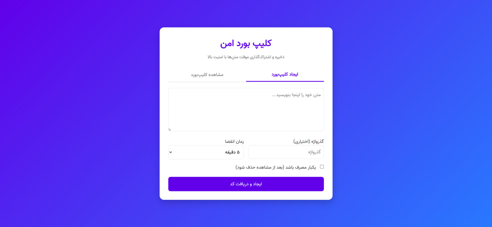

<div align="center">

# 🔐 Secure Clipboard

**A privacy-first, temporary pastebin with end-to-end encryption**

[](https://paste.sforati.ir)
[](https://python.org)
[](https://flask.palletsprojects.com)
[](LICENSE)

_Store and share sensitive text snippets securely — with automatic expiration, password protection, and optional end-to-end encryption._




</div>

The application is publicly available at **[paste.sforati.ir](https://paste.sforati.ir)**.

---

## ✨ Features

### 🔑 Multiple Layers of Security

| Feature | Description |
|---|---|
| **Server-Side Encryption** | All clips are encrypted at rest using Fernet (AES-128-CBC + HMAC-SHA256) |
| **Client-Side Encryption** | Optional browser-based AES-256-GCM encryption before data is ever sent to the server |
| **Password Protection** | Per-clip passwords hashed on the server and/or used as encryption keys client-side |
| **CSRF Protection** | Every state-changing request is validated with a CSRF token |
| **Rate Limiting** | Per-IP request throttling (40 requests / 60 seconds) to prevent abuse |

### ⏳ Expiration & Lifecycle

- Configurable expiry: **5 min · 10 min · 30 min · 1 h · 12 h · 1 day · 1 week · 1 month**
- **One-time clips** — automatically deleted after the first view
- Expired clips are detected and removed on access

### 🎯 Usability

- Clean tab-based interface for **creating** and **viewing** clips
- Shareable **6-digit numeric codes** (easy to dictate or type)
- Auto-focus navigation across code input boxes
- Paste a full 6-digit code in a single keystroke
- Copy-to-clipboard with visual confirmation
- Animated progress indicator during client-side encryption
- Responsive **Persian (Farsi) UI** with RTL layout and Vazir font

---

## 🏗️ Architecture & Infrastructure

### Backend

| Component | Technology |
|---|---|
| Language | Python 3 |
| Web Framework | [Flask](https://flask.palletsprojects.com) |
| Database | SQLite 3 (WAL mode) |
| Password Hashing | `werkzeug.security` (PBKDF2-SHA256) |
| Symmetric Encryption | `cryptography.fernet.Fernet` |
| Secure Tokens | Python `secrets` module |

### Frontend

| Component | Technology |
|---|---|
| Markup | HTML5 |
| Styling | Custom CSS (gradients, RTL, purple/blue theme) |
| Font | [Vazir](https://github.com/rastikerdar/vazir-font) (Persian, woff2) |
| Encryption | [Web Crypto API](https://developer.mozilla.org/en-US/docs/Web/API/Web_Crypto_API) — native browser |
| HTTP | Fetch API (async/await) |

### Deployment

| Aspect | Detail |
|---|---|
| HTTP Port | `5090` |
| HTTPS Port | `5091` (activated automatically when `cert.pem` + `key.pem` are present) |
| Binding | `0.0.0.0` (all interfaces) |
| Debug Mode | Disabled in production |
| Config | Environment variable `APP_SECRET_KEY` or auto-generated file |

---

## 🔒 Security Deep-Dive

### 1 · Server-Side Encryption (Always On)

Every clip is encrypted before being written to the SQLite database using **Fernet symmetric encryption** (part of the Python `cryptography` library). Fernet combines AES-128 in CBC mode with an HMAC-SHA256 authentication tag, guaranteeing both confidentiality and integrity. The encryption key is stored in `encryption.key` and auto-generated on first run.

### 2 · Client-Side End-to-End Encryption (Optional)

When a user sets a password, the plaintext **never leaves the browser unencrypted**. The following steps happen entirely in the browser before any data is sent:

1. A random **16-byte salt** is generated.
2. **PBKDF2-SHA256** derives a 256-bit AES key from the password using **250,000 iterations**.
3. A random **12-byte IV** is generated.
4. The content is encrypted with **AES-256-GCM** — providing authenticated encryption.
5. The structured payload `{ v, alg, kdf, iter, salt, iv, ct }` is transmitted to the server.

The server stores the opaque encrypted blob and **never sees the plaintext or the password**.

```
Browser                                     Server
  │  password + plaintext                     │
  │  ──PBKDF2(250k)──► AES-GCM key           │
  │  encrypt ──► { salt, iv, ciphertext }     │
  │ ────────────── HTTPS POST ──────────────► │
  │                                     store │
  │                                     blob  │
```

Decryption is the exact reverse — the server sends the blob back and the browser decrypts it locally.

### 3 · CSRF Protection

A per-session CSRF token is required on every POST request. It can be submitted either as a form field (`csrf_token`) or as the `X-CSRF-Token` HTTP header. Requests with missing or invalid tokens are rejected with an error message.

### 4 · Rate Limiting

A lightweight in-process rate limiter tracks request counts per **client IP** (honoring `X-Forwarded-For` for reverse-proxy deployments). The default policy is **40 requests per 60-second window** per IP across the create, view, and consume endpoints.

### 5 · One-Time Clips

Clips flagged as one-time are deleted from the database immediately after the first successful retrieval, ensuring the content can never be accessed a second time.

### 6 · Secret Management

| Secret | Source (priority order) |
|---|---|
| Flask session key | `APP_SECRET_KEY` env var → `app_secret.key` file → auto-generated |
| Fernet encryption key | `encryption.key` file → auto-generated |

Both key files are excluded from version control via `.gitignore`.

---

## 🗄️ Database Schema

```sql
CREATE TABLE clips (
    id                 INTEGER  PRIMARY KEY AUTOINCREMENT,
    code               TEXT     UNIQUE NOT NULL,       -- 6-digit zero-padded code
    content_encrypted  TEXT     NOT NULL,              -- Fernet-encrypted content
    password_hash      TEXT,                           -- Werkzeug password hash (optional)
    expire_at          DATETIME,                       -- Expiry timestamp (ISO 8601)
    is_one_time        BOOLEAN  DEFAULT 0,             -- Delete after first view
    is_client_encrypted BOOLEAN DEFAULT 0,            -- Whether payload is AES-GCM blob
    created_at         DATETIME DEFAULT CURRENT_TIMESTAMP
);
```

---

## 🛣️ API Routes

| Method | Route | Description |
|---|---|---|
| `GET` | `/` | Main page (create / view tabs) |
| `POST` | `/` | Create a clip or look up a clip by code |
| `GET` | `/<code>` | Redirect/display a clip by its 6-digit code |
| `POST` | `/<code>` | Submit password for a protected clip |
| `POST` | `/consume-client-clip` | Mark a one-time client-encrypted clip as consumed |
| `GET` | `/favicon.ico` | Serve browser icon |

---

## 🚀 Getting Started

### Prerequisites

- Python 3.8+
- pip

### Installation

```bash
# Clone the repository
git clone https://github.com/foratik/Secure-Clipboard.git
cd Secure-Clipboard

# Install dependencies
pip install flask cryptography werkzeug

# (Optional) Set a custom secret key
export APP_SECRET_KEY="your-strong-random-secret"

# Run the application
python pastebin.py
```

The app will be available at `http://localhost:5090`.

### HTTPS (Optional)

Place your SSL certificate and private key as `cert.pem` and `key.pem` in the project root. The app will automatically detect them and start on `https://localhost:5091`.

---

## 📦 Dependencies

| Package | Purpose |
|---|---|
| `flask` | Web framework & routing |
| `cryptography` | Fernet encryption, secure key generation |
| `werkzeug` | Password hashing (PBKDF2), WSGI utilities |
| `sqlite3` | Built-in — embedded relational database |
| `secrets` | Built-in — cryptographically secure random tokens |

---

## 🤝 Contributing

Contributions, issues, and feature requests are welcome. Please open an issue first to discuss what you would like to change.

