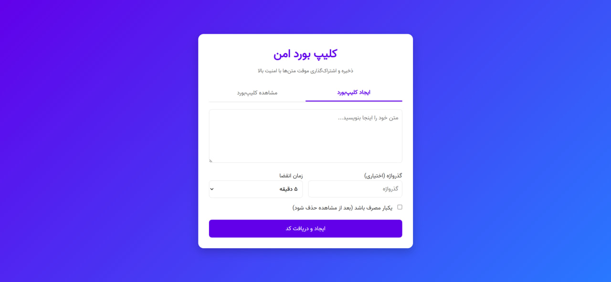

<div align="center">

# 🔐 Secure Clipboard

**A privacy-first temporary pastebin with client-side encryption and a hidden admin dashboard**

[](https://python.org)
[](https://flask.palletsprojects.com)
[](LICENSE)



</div>


Secure Clipboard is a lightweight Persian pastebin built for temporary sharing, optional client-side encryption, and minimal data retention.

The application is publicly available at **[clip-board.ir](https://clip-board.ir)** and **[paste.sforati.ir](https://paste.sforati.ir)**.

---

## ✨ Highlights

- **Short-lived links** with configurable expiration times
- **Client-side encryption** in the browser when a password is entered
- **One-time clips** that are deleted after the first successful view
- **CSRF protection** and **per-IP rate limiting**
- **RTL Persian UI** with Vazir font and a polished dashboard
- **Private admin panel** with charts and analytics

---

## 🛡️ Admin dashboard

The dashboard is intentionally hidden and not exposed on a predictable public path.

- The route is read from `ADMIN_SECRET_PATH` in the local `.env`
- Login uses `ADMIN_USERNAME` and `ADMIN_PASSWORD`
- Access is limited by `ADMIN_ALLOWED_IPS`
- Charts use a **local** Chart.js bundle, not a CDN

Optional `.env` values:

```dotenv
APP_SECRET_KEY=your-long-random-secret
ADMIN_SECRET_PATH=your-unguessable-path
ADMIN_USERNAME=admin
ADMIN_PASSWORD=your-strong-password
ADMIN_ALLOWED_IPS=127.0.0.1,::1
ADMIN_ACCESS_TOKEN=
```

---

## 🚀 Quick start

```bash
pip install flask cryptography werkzeug
python pastebin.py
```

Open the app at `http://localhost:5090`.

If `cert.pem` and `key.pem` are present in the project root, the app also serves HTTPS on `https://localhost:5091`.

---

## 🔎 What’s stored

- Normal clips are encrypted on the server before being saved.
- Password-protected clips are encrypted in the browser; the server receives only the encrypted payload.
- One-time clips are removed from the main table after the first view, while separate analytics keep only counts and metadata.

---

## 📦 Local assets

- `static/Vazir-Regular-FD.woff2` for the Persian UI
- `static/chart.umd.min.js` for the dashboard charts

